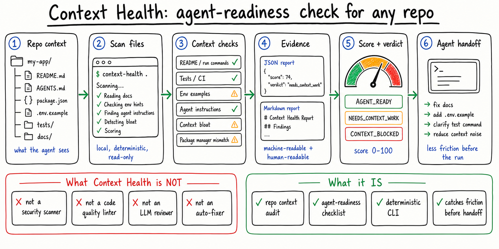

# Context Health



`context-health` checks whether a repo gives coding agents enough working context to make useful changes: run commands, test commands, env examples, agent instructions, and avoidable context bloat.

Run it before handing a repo to a coding agent to catch the missing "how do I run this?", "how do I test this?", and "what should the agent know first?" details that often slow down an otherwise straightforward task.

For a copy-paste workflow, see [docs/agent-handoff-recipe.md](docs/agent-handoff-recipe.md).

It does not judge code quality, guarantee agent success, review security, scan dependencies for vulnerabilities, or call an LLM. It is a small local CLI for repository context readiness.

## Install

From a local checkout:

```bash
python -m pip install -e ".[dev]"
```

The package is not currently published to PyPI, so install from a checkout rather than using `pip install context-health`.

## Scan A Repo

```bash
context-health .
```

`context-health .` prints a score, verdict, and the highest-value findings to fix before agent handoff.

Example terminal output:

```text
Context Health: 59/100 - needs_context_work

Top findings:
  [high] docs.missing_readme
    No root README.md, readme.md, or README file was found
    fix: Add README with purpose, install, run, and test commands
```

## JSON Output

```bash
context-health . --json
```

The JSON report includes `score`, `verdict`, `summary`, `repo_profile`, `recommendations`, and evidence-backed `findings`. For monorepos, `repo_profile.workspaces` includes detected workspace patterns such as `apps/*` and `packages/*`.

See [docs/findings.md](docs/findings.md) for the current finding catalog.

```json
{
  "score": 62,
  "verdict": "needs_context_work",
  "findings": [
    {
      "id": "env.missing_example",
      "title": "Environment example file is missing",
      "severity": "high",
      "category": "env",
      "path": null,
      "line": null,
      "evidence": "Code references env vars (API_KEY) but no .env.example or .env.sample exists",
      "recommendation": "Add .env.example with required key names and fake values"
    }
  ]
}
```

## Markdown Report

```bash
context-health . --markdown context-health-report.md
```

Markdown output is useful for saving a readable handoff report alongside an issue, pull request, or agent prompt.

JSON stays valid when Markdown is also requested:

```bash
context-health . --json --markdown context-health-report.md
```

On Windows PowerShell 5.1, bare `>` redirection can write UTF-16 files. Prefer `cmd /c "context-health . --json > report.json"` or write stdout as UTF-8 before piping to JSON tooling.

## CI Gate

Use `--fail-under` to turn a low score into exit code `1`:

```bash
context-health . --fail-under 80
```

Invalid paths and usage errors exit `2`.

Example GitHub Actions gate:

```yaml
- name: Dogfood context health
  run: context-health . --fail-under 95
```

## Config File

Commit `.context-health.toml` at the repo root to set stable scan defaults:

```toml
include = ["src/**", "README.md"]
exclude = ["docs/generated/**"]
max_file_kb = 256
fail_under = 80
```

CLI flags still win: `--include` and `--exclude` extend config lists, while `--max-file-kb` and `--fail-under` override config values.

## Options

```text
context-health [path] [--json] [--markdown PATH] [--fail-under SCORE]
               [--include GLOB] [--exclude GLOB] [--max-file-kb KB]
               [--verbose]
```

Default ignores include `.git`, `node_modules`, `.next`, `dist`, `build`, `coverage`, virtualenv folders, caches, and similar generated dependency paths.

## What v0.1 Checks

- README presence and run/test command documentation
- `.env.example` or `.env.sample` when code references env vars
- obvious `.env` files committed to the repo
- root or discoverable agent instructions, including setup/run/test guidance
- conflicting package manager signals
- possible conflicts between agent instruction files and simple README/AGENTS command mismatches
- large text files and generated artifacts that remain in scanned paths
- test command and CI evidence

## What v0.1 Does Not Do

- Web UI
- SaaS backend
- GitHub App
- Auto-fix mode
- LLM review
- MCP server
- dependency vulnerability scanning
- security review
- telemetry

## Development

```bash
python -m pip install -e ".[dev]"
context-health --help
pytest -q
python scripts/package_smoke.py
```

The package smoke builds wheel and sdist artifacts, checks representative sdist test assets, installs the wheel into a fresh virtual environment, and runs the installed CLI.
